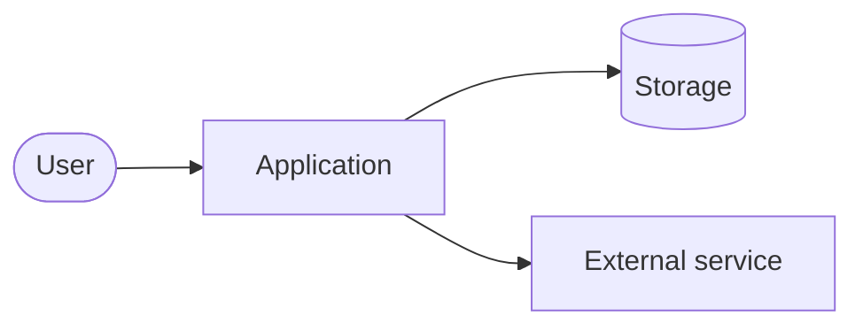

# Architecture

Describe the main parts of the system and how they talk to each other. Replace the skeleton below.

```mermaid
flowchart LR
  user([User]) --> app[Application]
  app --> store[(Storage)]
  app --> ext[External service]
```

Decisions that shaped this design are in `docs/adr/`.
